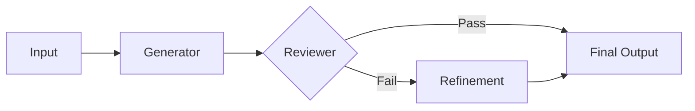

# AI Assessment Generator


## Overview

The AI Assessment Generator is a multi-agent system engineered to produce validated educational content. It utilizes a **Generator-Reviewer-Refiner** architectural pattern to ensure output quality, accuracy, and age-appropriateness. The system leverages the Google Gemini 2.0 Flash model for high-speed inference and reasoning.

[**Live Application**](https://hiring-assigment-eklavya.vercel.app/)

## System Architecture

The application is built upon a linear execution pipeline with a conditional feedback loop:

1.  **Generator Agent**: Synthesizes the initial content and associated multiple-choice questions (MCQs) based on the input parameters (Grade Level and Topic).
2.  **Reviewer Agent**: Performs a critical analysis of the generated content against predefined heuristics (Conceptual Accuracy, Clarity, Age Appropriateness).
3.  **Refinement Loop**: If the Reviewer Agent rejects the content, the feedback is fed back into the Generator Agent for a targeted refinement pass.
4.  **Structured Output**: All agents enforce strict JSON schemas to ensure reliable downstream consumption.



## Technical Stack

-   **Backend Framework**: FastAPI (Python)
-   **LLM Provider**: Google Gemini API (gemini-2.0-flash)
-   **Frontend**: Vanilla HTML5/CSS3/JavaScript (No external frameworks)
-   **Deployment**: Vercel Serverless Function

## Features

-   **Automated Content Validation**: Multi-stage review process minimizes hallucinations and ensures quality.
-   **Strict Schema Enforcement**: Guarantees consistent JSON structure for both content and assessment data.
-   **Developer Inspection Tools**: Integrated split-screen debugging interface for analyzing raw JSON payloads and Reviewer feedback in real-time.
-   **Direct-to-Backend Architecture**: Unified server handling both API routes and static asset delivery for simplified deployment.

## Installation and Setup

### Prerequisites

-   Python 3.9 or higher
-   Google Gemini API Key

### Configuration

1.  **Clone the repository:**
    ```bash
    git clone https://github.com/AbhinavKumar0000/Hiring-Assigment-Eklavya.git
    cd Hiring-Assigment-Eklavya
    ```

2.  **Install dependencies:**
    ```bash
    pip install -r requirements.txt
    ```

3.  **Environment Variables:**
    Create a `.env` file in the root directory:
    ```env
    GEMINI_API_KEY=your_actual_api_key
    ```

### Execution

Start the application server:
```bash
python -m backend.main
```

The application will be accessible at `http://localhost:8000`.

## Debugging

The application provides a dedicated debug interface for inspecting the internal state of the agents. Click the `< >` icon in the application header to toggle the inspection panel. This panel displays the full JSON response from the backend, including the Reviewer's critique and any refinement metadata.

## Deployment

The project is optimized for deployment on Vercel.

1.  **Entry Point**: The application uses `api/index.py` as the Vercel entry point.
2.  **Rewrites**: `vercel.json` maps all incoming requests to the FastAPI application.
3.  **Environment**: Ensure `GEMINI_API_KEY` is configured in the deployment environment settings.

---
*Built for the Eklavya Hiring Assignment.*
