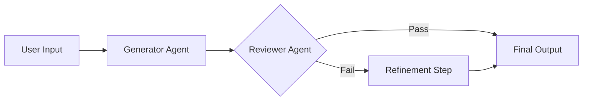

# AI Assessment Generator


A robust, multi-agent AI system designed to generate validated educational content. It employs a **Generator-Reviewer-Refiner** pipeline to ensure high-quality, age-appropriate material for students.

[**🚀 Live Demo**](https://hiring-assigment-eklavya.vercel.app/)

---

## 🌟 Key Features

- **Multi-Agent Architecture**:
    - **Generator Agent**: Creates initial content and MCQs based on grade and topic.
    - **Reviewer Agent**: Critiques the content for accuracy, age-appropriateness, and clarity.
    - **Refinement Loop**: Automatically improves content if the Reviewer flags issues.
- **Strict JSON Enforcement**: Ensures structured, reliable outputs suitable for downstream integration.
- **Developer Debug Mode**: dedicated split-screen UI to inspect raw JSON payloads and API responses in real-time.
- **Modern UI**: Fully responsive, dark-mode compatible interface built with vanilla CSS (no heavy frameworks).

## 🏗️ Architecture

The system follows a linear pipeline with a conditional feedback loop:



### Agents
1.  **Generator (`backend/generator.py`)**: Uses `gemini-2.0-flash` to craft educational explanations and multiple-choice questions.
2.  **Reviewer (`backend/reviewer.py`)**: Evaluates the output against strict criteria (Conceptual Correctness, Clarity, Age Appropriateness).

## 🛠️ Technology Stack

- **Backend**: FastAPI (Python)
- **AI Model**: Google Gemini 2.0 Flash
- **Frontend**: HTML5, CSS3 (Grid/Flexbox), Vanilla JavaScript
- **Deployment**: Vercel (Serverless)

## 🚀 Getting Started

### Prerequisites
- Python 3.9+
- A Google Gemini API Key

### Installation

1.  **Clone the repository**
    ```bash
    git clone https://github.com/AbhinavKumar0000/Hiring-Assigment-Eklavya.git
    cd Hiring-Assigment-Eklavya
    ```

2.  **Install dependencies**
    ```bash
    pip install -r requirements.txt
    ```

3.  **Set up Environment Variables**
    Create a `.env` file in the root directory:
    ```env
    GEMINI_API_KEY=your_api_key_here
    ```

4.  **Run the Application**
    Start the unified backend server:
    ```bash
    python -m backend.main
    ```

5.  **Access the App**
    Open your browser to: `http://localhost:8000`

## 📂 Project Structure

```
├── api/                  # Vercel entrypoint
├── backend/
│   ├── generator.py      # LLM Content Generation Logic
│   ├── reviewer.py       # LLM Review/Critique Logic
│   ├── pipeline.py       # Orchestration Layer
│   └── main.py           # FastAPI Application & Static Serving
├── frontend/
│   ├── index.html        # Main UI
│   ├── style.css         # Responsive Styles
│   └── script.js         # Frontend Logic & API Integration
├── requirements.txt
├── vercel.json           # Deployment Config
└── README.md
```

## 🔍 Debug Mode

The application includes a built-in **JSON Inspector**. Click the code icon (`< >`) in the top-right corner to toggle a persistent side panel. This allows specific inspection of:
- The exact payload sent to the backend.
- The raw JSON response from the agents (useful for seeing the Reviewer's feedback).

## ☁️ Deployment

This project is configured for seamless deployment on **Vercel**.

1.  Push code to GitHub.
2.  Import project into Vercel.
3.  Add `GEMINI_API_KEY` to Vercel Environment Variables.
4.  The `vercel.json` and `api/index.py` handle the rest automatically.

---
*Built for the Eklavya Hiring Assignment.*
